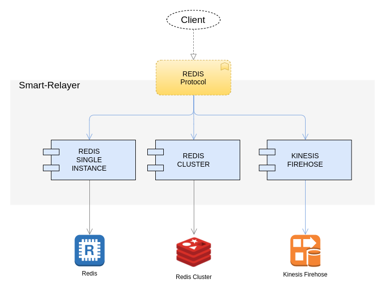

# Smart relayer in Golang for cache servers

Currently under heavy development.

Smart-relayer is a extremely light proxy daemon that runs always in the clients' localhost. It listens for local connections for different protocols (currently supports Redis) and forwards the commands to the remote server. But the client doesn't have to wait until the operation is completed, smart-relayer detects commands that can be sent in "background" and responds to the client immediately so the application can continue its execution without waiting for a response from the remote server.

Furthermore, it optimizes the connection by pipelining commands when possible (as in Redis) and avoid unnecessary commands, for example "select database" in Redis when the current database is the same as the one being selected.



## Motivation

My team at DOTW is in charge of operations of its large Amazon AWS platform. It receives more than 5000 requests/sec, each one produces several megabytes of logs and hot data that have to be stored on several ElastiCache Redis and Memcache clusters. We wanted to reduce the latency in the clients and also reduce the number of network connections at every workers.

The main application is very complex and huge, more than one million lines in PHP (that the reason the examples are in PHP, we have to test and validate this daemon against PHP Redis clients) and generates more the 50 MBytes of data for each request. So this smart-cache project is a first step to decouple the application from the burden of storing a huge volume of data in the cache clusters.

## Features

It support the Redis protocol with and without the "smart" mode. The next modules will be HTTP based cache.

The storage servers currently supported are **Redis** (single node), **Redis-cluster** (proved in AWS ElasticCache) and **Kinesis Firehose**.

Smart-relay can listen to different local ports, each one for a specific protocol and target. The clients connect always to the same port using the same client libraries, only the address of the server has to be changed to point to `localhost:SOME_PORT`.

Smart-relay uses only a persistent connection for every target so no time is spent establishing the connection to the remote server even if the client libraries or the application don't support persistent connections.


### Redis
It can listen to several local ports for different targets. It support two modes:

#### Synchronized (working)
It doesn't execute command in background, all commands block the client. The only optimization is the pipelining of commands coming from different clients.

#### Smart (working)
It allows to send command and data asynchronously, smart-relayer detects the commands that can be executed in "background" and immediately responds to the client and continue sending the commands to the server in another thread.

The first tests show promising results.

For example the PHP script https://github.com/gallir/smart-relayer/blob/master/examples/redis_noget.php takes 7.1 secs to execute a remote server, with smart-cache takes 0.4 secs (yes! the number is right). Executing in two parallel process the take in average 8.2 secs and 2.2 secs respectively (limited by my laptop's CPU).

The script that does "blocking" GET's in every cycle (https://github.com/gallir/smart-relayer/blob/master/examples/redis.php) without smart-relayer takes 9.9 secs and with smart-cache 4.7 secs on average. Two PHP processes in parallel take 10.7 secs and 5.5 secs respectively.


### Kinesis Firehose
It can listen to several local ports for different target [firehose streams](http://docs.aws.amazon.com/firehose/latest/dev/what-is-this-service.html).

#### Smart (working)
This plugin makes easy to store large amount of data without blocking the calling from client processes. Data records will be sent asynchronously to Kinesis using the AWS official API. With this approach the application can send data to S3 without with a minimum penalty in the application response time.

#### Features
Every record will be converted to json and store it in S3 using Kinesis Firehose
Supports simple commands "SET KEY VALUE", each of this commands will be stored as one  JSON line.

Supports transactions. Using the MULT/EXEC commands of the redis protocol, all the content of the transaction will stored as one single json.

RAW content. The bytes sent using RAWSET command will be send without modifications to kiensis firehose.

##### Commands supported
- **SET**: Key -> Value
- **SADD**: Key -> [Value1, Value2, Value3,...]
- **HMSET**: Key -> [ { Key1 => Value1}, { Key2 => Value2 },...]
- **RAWSET**: raw bytes

Examples client avaialble in [examples/firehose.php](examples/firehose.php)


## Usage

```
git clone git@github.com:gallir/smart-relayer.git
cd smart-relayer
go build
```

Then copy `relayer.conf` and edit it specify the address of your server and the desired ports, the syntax and meaning of each variable are easy to understand.

To run it:

```
./smart-relayer -c configuration.conf
```

If the environment variable ``DEBUG`` is defined then the program will show more information.
